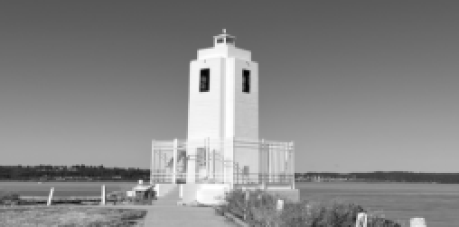
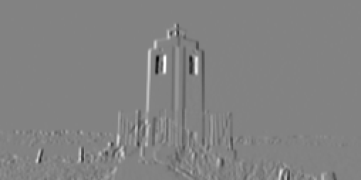
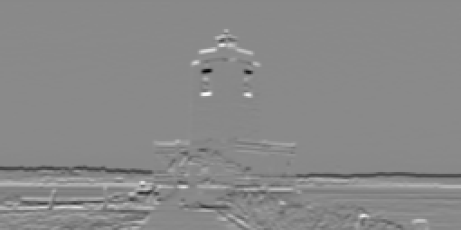
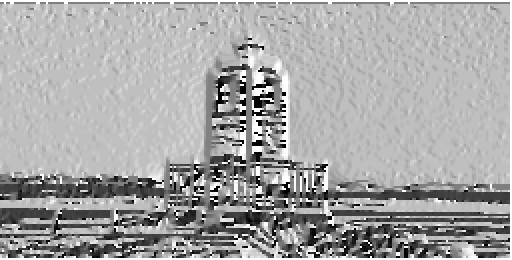

# 2. Feature Extraction

## Computer Vision Algorithms

### Filters

In the `VisualAlgo::FeatureExtraction` namespace, a suite of filter classes are provided for image processing tasks:

- `Filter`: A base class with a pure virtual `apply` method for applying the filter to an image. 

- `GaussianFilter`: A subclass of `Filter` that implements a Gaussian filter for image smoothing and noise reduction. It provides a constructor `GaussianFilter(float sigma)` to create a Gaussian filter with a specified sigma value, and overrides the `apply` method to perform Gaussian filtering on an image.

- `SobelFilterX` and `SobelFilterY`: These are subclasses of `Filter` that implement the Sobel filter in the x and y directions respectively, used for edge detection and feature extraction tasks. The constructors `SobelFilterX()` and `SobelFilterY()` create the respective filters, and the `apply` method is overridden in each class to apply the corresponding Sobel filter on an image.

#### Example Usage

In this example, the `GaussianFilter`, `SobelFilterX`, and `SobelFilterY` classes are used to apply corresponding filters to an image. The filtered images are then saved for later analysis or visualization.

```cpp
#include "FeatureExtraction/Filter.hpp"
#include "helpers/Matrix.hpp"

VisualAlgo::Matrix image;
image.load("datasets/FeatureExtraction/cat_resized.ppm");
image.normalize();

VisualAlgo::FeatureExtraction::GaussianFilter gaussianFilter(0.8f);
VisualAlgo::FeatureExtraction::SobelFilterX sobelXFilter;
VisualAlgo::FeatureExtraction::SobelFilterY sobelYFilter;

VisualAlgo::Matrix image_gaussian, image_sobel_x, image_sobel_y;
image_gaussian = gaussianFilter.apply(image);
image_sobel_x = sobelXFilter.apply(image);
image_sobel_y = sobelYFilter.apply(image);

image_gaussian.save("datasets/FeatureExtraction/cat_gaussian.ppm", true);
image_sobel_x.save("datasets/FeatureExtraction/cat_sobel_x.ppm", true);
image_sobel_y.save("datasets/FeatureExtraction/cat_sobel_y.ppm", true);
```

In this code, instances of `GaussianFilter`, `SobelFilterX`, and `SobelFilterY` are directly created. Each filter is then applied to the loaded image by calling their `apply` function, and the resulting filtered images are saved to files for later analysis or visualization.

---

### Gradients Class (`VisualAlgo::FeatureExtraction::Gradients`)

The `Gradients` class in the `VisualAlgo::FeatureExtraction` namespace is a utility class for computing the x and y gradients of an image, which are important components in various computer vision and image processing tasks such as edge detection and feature extraction. 

#### Static Functions

* `Matrix computeXGradient(const Matrix& image)`: This function computes the x-direction gradients of the image.

* `Matrix computeYGradient(const Matrix& image)`: This function computes the y-direction gradients of the image.

* `Matrix computeGradientMagnitude(const Matrix& xGradient, const Matrix& yGradient)`: This function computes the magnitude of the gradient at each pixel, defined as the square root of the sum of the squares of the x and y gradients. The output is a `Matrix` where each element represents the gradient magnitude at the corresponding pixel.

* `Matrix computeGradientDirection(const Matrix& xGradient, const Matrix& yGradient, float threshold = 0.01)`: This function computes the direction of the gradient at each pixel, defined as the arctangent of the ratio of the y-gradient to the x-gradient. It accepts a threshold parameter to filter out low magnitude gradients, reducing the noise. Any gradient with a magnitude less than the threshold will be set to zero in the output matrix.

#### Example Usage

In this example, the `Gradients` class is used to compute the x and y gradients of an image. These gradients are then saved to file and compared with the expected gradients to ensure the computations are correct.

```cpp
#include "FeatureExtraction/Gradients.hpp"
#include "helpers/Matrix.hpp"

VisualAlgo::Matrix image;
image.load("datasets/FeatureExtraction/cat_resized.ppm");
image.normalize();

VisualAlgo::Matrix image_x_gradient, image_y_gradient;
image_x_gradient = VisualAlgo::FeatureExtraction::Gradients::computeXGradient(image);
image_y_gradient = VisualAlgo::FeatureExtraction::Gradients::computeYGradient(image);

VisualAlgo::Matrix gradient_direction;
gradient_direction = VisualAlgo::FeatureExtraction::Gradients::computeGradientDirection(image_x_gradient, image_y_gradient, 0.01);

image_x_gradient.save("datasets/FeatureExtraction/cat_x_gradient.ppm", true);
image_y_gradient.save("datasets/FeatureExtraction/cat_y_gradient.ppm", true);
gradient_direction.save("datasets/FeatureExtraction/cat_gradient_direction.ppm", true);
```

In this code, `computeXGradient` and `computeYGradient` are used to calculate the x and y gradients of the loaded image respectively. The `computeGradientDirection` function is then used to calculate the gradient direction of the image, with a threshold of 0.01 for filtering out low magnitude gradients. The resulting gradient direction image is then saved to file for later analysis or visualization.

#### Warning

The gradient direction computation involves taking the arctangent of the ratio of the y-gradient to the x-gradient. In areas of the image where the x-gradient is near zero, this ratio can become very large or very small, leading to potential instability in the arctangent calculation. To mitigate this, we provide an option to set a threshold, under which the gradient magnitude is deemed insignificant and the direction is set to zero, reducing the influence of noise or small variations in uniform areas of the image. However, care should be taken when setting the threshold as a very high value might discard relevant information while a very low value might not effectively filter out the noise.

#### Visual Examples

Below are visual examples of the original image and the computed gradients, gradient magnitude, and gradient direction.

Original Image:



X-direction Gradient:



Y-direction Gradient:



Gradient Magnitude:


Gradient Direction:



---

### Non-Maximum Suppression (For Edges, not Bounding Boxes)

---

### Canny Edge Detection

---

### Corner Detection

---

### Blob Detection

---

### SIFT

---

### SURF

---

### ORB

---

### HOG

---


## Neuroscience Models

### Simple and Complex Cell Models

---

