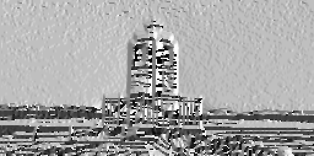

# 2. Feature Extraction

## Computer Vision Algorithms

### Filters

In the `VisualAlgo::FeatureExtraction` namespace, a suite of filter classes are provided for image processing tasks:

- `Filter`: A base class with a pure virtual `apply` method for applying the filter to an image. 

- `GaussianFilter`: A subclass of `Filter` that implements a Gaussian filter for image smoothing and noise reduction. It provides a constructor `GaussianFilter(float sigma)` to create a Gaussian filter with a specified sigma value, and overrides the `apply` method to perform Gaussian filtering on an image.

- `SobelFilterX` and `SobelFilterY`: These are subclasses of `Filter` that implement the Sobel filter in the x and y directions respectively, used for edge detection and feature extraction tasks. The constructors `SobelFilterX()` and `SobelFilterY()` create the respective filters, and the `apply` method is overridden in each class to apply the corresponding Sobel filter on an image.

#### Example Usage

In this example, the `GaussianFilter`, `SobelFilterX`, and `SobelFilterY` classes are used to apply corresponding filters to an image. The filtered images are then saved for later analysis or visualization.

```cpp
#include "FeatureExtraction/Filter.hpp"
#include "helpers/Matrix.hpp"

VisualAlgo::Matrix image;
image.load("datasets/FeatureExtraction/cat_resized.ppm");
image.normalize();

VisualAlgo::FeatureExtraction::GaussianFilter gaussianFilter(0.8f);
VisualAlgo::FeatureExtraction::SobelFilterX sobelXFilter;
VisualAlgo::FeatureExtraction::SobelFilterY sobelYFilter;

VisualAlgo::Matrix image_gaussian, image_sobel_x, image_sobel_y;
image_gaussian = gaussianFilter.apply(image);
image_sobel_x = sobelXFilter.apply(image);
image_sobel_y = sobelYFilter.apply(image);

image_gaussian.save("datasets/FeatureExtraction/cat_gaussian.ppm", true);
image_sobel_x.save("datasets/FeatureExtraction/cat_sobel_x.ppm", true);
image_sobel_y.save("datasets/FeatureExtraction/cat_sobel_y.ppm", true);
```

In this code, instances of `GaussianFilter`, `SobelFilterX`, and `SobelFilterY` are directly created. Each filter is then applied to the loaded image by calling their `apply` function, and the resulting filtered images are saved to files for later analysis or visualization.

---

### Gradients Class (`VisualAlgo::FeatureExtraction::Gradients`)

The `Gradients` class in the `VisualAlgo::FeatureExtraction` namespace is a utility class for computing the x and y gradients of an image, which are important components in various computer vision and image processing tasks such as edge detection and feature extraction. 

#### Static Functions

* `Matrix computeXGradient(const Matrix& image)`: This function computes the x-direction gradients of the image.

* `Matrix computeYGradient(const Matrix& image)`: This function computes the y-direction gradients of the image.

* `Matrix computeGradientMagnitude(const Matrix& xGradient, const Matrix& yGradient)`: This function computes the magnitude of the gradient at each pixel, defined as the square root of the sum of the squares of the x and y gradients. The output is a `Matrix` where each element represents the gradient magnitude at the corresponding pixel.

* `Matrix computeGradientDirection(const Matrix& xGradient, const Matrix& yGradient, float threshold = 0.01)`: This function computes the direction of the gradient at each pixel, defined as the arctangent of the ratio of the y-gradient to the x-gradient. It accepts a threshold parameter to filter out low magnitude gradients, reducing the noise. Any gradient with a magnitude less than the threshold will be set to zero in the output matrix.

#### Example Usage

In this example, the `Gradients` class is used to compute the x and y gradients of an image. These gradients are then saved to file and compared with the expected gradients to ensure the computations are correct.

```cpp
#include "FeatureExtraction/Gradients.hpp"
#include "helpers/Matrix.hpp"

VisualAlgo::Matrix image;
image.load("datasets/FeatureExtraction/cat_resized.ppm");
image.normalize();

VisualAlgo::Matrix image_x_gradient, image_y_gradient;
image_x_gradient = VisualAlgo::FeatureExtraction::Gradients::computeXGradient(image);
image_y_gradient = VisualAlgo::FeatureExtraction::Gradients::computeYGradient(image);

VisualAlgo::Matrix gradient_direction;
gradient_direction = VisualAlgo::FeatureExtraction::Gradients::computeGradientDirection(image_x_gradient, image_y_gradient, 0.01);

image_x_gradient.save("datasets/FeatureExtraction/cat_x_gradient.ppm", true);
image_y_gradient.save("datasets/FeatureExtraction/cat_y_gradient.ppm", true);
gradient_direction.save("datasets/FeatureExtraction/cat_gradient_direction.ppm", true);
```

In this code, `computeXGradient` and `computeYGradient` are used to calculate the x and y gradients of the loaded image respectively. The `computeGradientDirection` function is then used to calculate the gradient direction of the image, with a threshold of 0.01 for filtering out low magnitude gradients. The resulting gradient direction image is then saved to file for later analysis or visualization.

#### Warning

The gradient direction computation involves taking the arctangent of the ratio of the y-gradient to the x-gradient. In areas of the image where the x-gradient is near zero, this ratio can become very large or very small, leading to potential instability in the arctangent calculation. To mitigate this, we provide an option to set a threshold, under which the gradient magnitude is deemed insignificant and the direction is set to zero, reducing the influence of noise or small variations in uniform areas of the image. However, care should be taken when setting the threshold as a very high value might discard relevant information while a very low value might not effectively filter out the noise.

#### Visual Examples

Below are visual examples of the original image and the computed gradients, gradient magnitude, and gradient direction.

Original Image:


X-direction Gradient:


Y-direction Gradient:


Gradient Magnitude:


Gradient Direction:



---

### Edge Non-Maximum Suppression

The `EdgeNonMaxSuppression` class in the `VisualAlgo::FeatureExtraction` namespace is used for edge thinning in an image. It operates by suppressing all the non-maximum edges in the computed gradient of the image, leading to thin edges in the output. This is a key step in several edge detection algorithms such as the Canny edge detector.


#### Class Methods

- `Matrix apply(const Matrix &image)`: This method takes as input a `Matrix` representing an image and applies edge non-maximum suppression to it. It first computes the x and y gradients of the image, then the gradient magnitude and direction using the `Gradients` class. After that, it calls the other `apply` method with the computed gradient magnitude and direction as arguments.

- `Matrix apply(const Matrix &gradientMagnitude, const Matrix &gradientDirection)`: This method takes as input a `Matrix` each representing the gradient magnitude and direction of an image. It then applies edge non-maximum suppression to it. For each pixel, it rounds the gradient direction to one of four possible directions, then compares the gradient magnitude of the current pixel with its two neighbors in the direction of the gradient. If the gradient magnitude of the current pixel is greater than both of its neighbors, it is preserved in the output; otherwise, it is suppressed.

#### Example Usage

In this example, the `EdgeNonMaxSuppression` class is used to apply edge non-maximum suppression to an image. The image is first loaded and normalized. The `apply` function of the `EdgeNonMaxSuppression` class is then called with the image as argument, and the resulting edge-thinned image is saved to file.

```cpp
#include "FeatureExtraction/EdgeNonMaxSuppression.hpp"
#include "helpers/Matrix.hpp"

VisualAlgo::Matrix image;
image.load("datasets/FeatureExtraction/cat_resized.ppm");
image.normalize();

VisualAlgo::FeatureExtraction::EdgeNonMaxSuppression edgeNonMaxSuppression;
VisualAlgo::Matrix edge_thinned_image;
edge_thinned_image = edgeNonMaxSuppression.apply(image);

edge_thinned_image.save("datasets/FeatureExtraction/cat_edge_non_max_suppression.ppm", true);
```

In this code, an instance of `EdgeNonMaxSuppression` is created. The `apply` function of this instance is called with the loaded and normalized image as argument. The function returns an edge-thinned image which is saved to file for later analysis or visualization.

#### Note

The implementation assumes that the image has already been smoothed to remove noise and that appropriate gradient magnitude and direction have been computed. The edge non-maximum suppression is then used to thin out the edges in the image.

---

### Canny Edge Detection

The `Canny` class in the `VisualAlgo::FeatureExtraction` namespace is an implementation of the Canny edge detection algorithm. The Canny edge detection algorithm, developed by John F. Canny in 1986, is a multi-stage algorithm used to detect a wide range of edges in images. The Canny algorithm involves several stages:

1. **Noise Reduction**: Since edge detection is susceptible to noise in an image, the first step is to remove the noise. This is typically done using a Gaussian filter.

2. **Gradient Calculation**: The edge in an image is the area where there is a sharp change in the color or intensity of the image. The Gradient calculation step measures this change in the x and y direction.

3. **Non-maximum Suppression**: The Gradient calculation process results in thick edges. The purpose of non-maximum suppression is to convert these thick edges into thin lines.

4. **Double Threshold**: Potential edges are determined by thresholding the remaining pixels based on their gradient value. This results in strong edges, weak edges, and non-edges.

5. **Edge Tracking by Hysteresis**: Weak edges are pruned based on their connectivity. If a weak edge is connected to a strong edge, it is considered part of an edge. Otherwise, it is discarded.

#### Class Members and Methods

- `Canny(float sigma, float low_threshold, float high_threshold)`: Constructor that initializes a `Canny` instance with the specified sigma value for the Gaussian filter, and low and high threshold values for edge detection.

- `Matrix apply(const Matrix &image)`: Applies the Canny edge detection algorithm to an input image. This function first applies Gaussian filtering to the input image for smoothing and noise reduction, then computes the gradients of the smoothed image. After that, it applies non-maximum suppression to the gradient magnitude of the image to thin the edges. Finally, it applies thresholding and edge tracking to detect the edges in the image.

- `Matrix applyThreshold(const Matrix &image)`: A private method that applies thresholding to an image based on the low and high threshold values. This is used to detect potential edges in the image.

- `Matrix trackEdges(const Matrix &image)`: A private method that tracks edges in an image using hysteresis thresholding. This is used to finalize the detected edges in the image.

#### Example Usage

In this example, the `Canny` class is used to apply the Canny edge detection algorithm to a series of images. The images are first loaded and normalized. The `apply` function of the `Canny` class is then called with each image as argument, and the resulting edge-detected images are saved to files. The detected edges are then compared with expected results to ensure the edge detection is correct.

```cpp
#include "helpers/Matrix.hpp"
#include "FeatureExtraction/Canny.hpp"

VisualAlgo::Matrix image, image_canny_expected;
image.load("datasets/FeatureExtraction/cat_resized.ppm");
image_canny_expected.load("datasets/FeatureExtraction/cat_expected_canny.ppm");

image.normalize();
image_canny_expected.normalize();

VisualAlgo::FeatureExtraction::Canny canny(1.0f, 0.1f, 0.2f);
VisualAlgo::Matrix image_canny = canny.apply(image);

image_canny.save("datasets/FeatureExtraction/cat_canny.ppm", true);
```

#### Visual Examples

Below are visual examples of the original image and the computed Canny edges.

Original Image:


Canny Edges (sigma = 1.0, low_threshold = 0.1, high_threshold = 0.2):


---

### Corner Detection

---

### Blob Detection

---

### SIFT

---

### SURF

---

### ORB

---

### HOG

---


## Neuroscience Models

### Simple and Complex Cell Models

---

