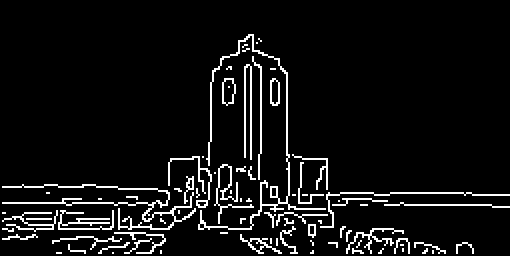

# 2. Feature Extraction

## Computer Vision Algorithms

### Filters

In the `VisualAlgo::FeatureExtraction` namespace, a set of filter classes are provided for image processing tasks:

- `Filter`: A base class with a pure virtual `apply` method for applying the filter to an image. 

- `GaussianFilter`: A subclass of `Filter` that implements a Gaussian filter for image smoothing and noise reduction. It provides a constructor `GaussianFilter(float sigma)` to create a Gaussian filter with a specified sigma value, and overrides the `apply` method to perform Gaussian filtering on an image. The formula for the 2D Gaussian kernel is:

$$
g(x, y) = \frac{1}{2\pi\sigma^2} \exp\left(-\frac{x^2 + y^2}{2\sigma^2}\right)
$$

- `SobelFilterX` and `SobelFilterY`: These are subclasses of `Filter` that implement the Sobel filter in the x and y directions respectively, used for edge detection and feature extraction tasks. The constructors `SobelFilterX()` and `SobelFilterY()` create the respective filters, and the `apply` method is overridden in each class to apply the corresponding Sobel filter on an image. The kernels are:

$$Sobel_x = \begin{bmatrix} -1 & 0 & 1 \\ -2 & 0 & 2 \\ -1 & 0 & 1 \end{bmatrix}$$
  
$$Sobel_y = \begin{bmatrix} -1 & -2 & -1 \\ 0 & 0 & 0 \\ 1 & 2 & 1 \end{bmatrix}$$

- `LoGFilter`: The Laplacian of Gaussian (LoG) filter, used for edge detection and blob detection tasks. The constructor `LoGFilter(float sigma)` creates a LoG filter with a specified sigma value, and overrides the `apply` method to perform LoG filtering on an image. The Laplacian of Gaussian is defined as the second derivative of the Gaussian, so applying the LoG operation to an image corresponds to smoothing the image with a Gaussian filter and then finding the second derivative of the result. The formula for the 2D LoG kernel is:

$$
g(x, y) = \frac{(x^2 + y^2 - 2\sigma^2)}{2\pi\sigma^4} \exp\left(-\frac{x^2 + y^2}{2\sigma^2}\right)
$$

#### Example Usage

In this example, the `GaussianFilter`, `SobelFilterX`, and `SobelFilterY` classes are used to apply corresponding filters to an image. The filtered images are then saved for later analysis or visualization.

```cpp
#include "FeatureExtraction/Filter.hpp"
#include "helpers/Matrix.hpp"

VisualAlgo::Matrix image;
image.load("datasets/FeatureExtraction/cat_resized.ppm");
image.normalize();

VisualAlgo::FeatureExtraction::GaussianFilter gaussianFilter(0.8f);
VisualAlgo::FeatureExtraction::SobelFilterX sobelXFilter;
VisualAlgo::FeatureExtraction::SobelFilterY sobelYFilter;

VisualAlgo::Matrix image_gaussian, image_sobel_x, image_sobel_y;
image_gaussian = gaussianFilter.apply(image);
image_sobel_x = sobelXFilter.apply(image);
image_sobel_y = sobelYFilter.apply(image);

image_gaussian.save("datasets/FeatureExtraction/cat_gaussian.ppm", true);
image_sobel_x.save("datasets/FeatureExtraction/cat_sobel_x.ppm", true);
image_sobel_y.save("datasets/FeatureExtraction/cat_sobel_y.ppm", true);
```

---

### Gradients Class

The `Gradients` class in the `VisualAlgo::FeatureExtraction` namespace is a utility class for computing the x and y gradients of an image, which are important components in various computer vision and image processing tasks such as edge detection and feature extraction. 

#### Static Functions

* `Matrix computeXGradient(const Matrix& image)`: This function computes the x-direction gradients of the image using a Sobel filter.

* `Matrix computeYGradient(const Matrix& image)`: This function computes the y-direction gradients of the image using a Sobel filter.

* `Matrix computeGradientMagnitude(const Matrix& xGradient, const Matrix& yGradient)`: This function computes the magnitude of the gradient at each pixel, defined as the square root of the sum of the squares of the x and y gradients. The output is a `Matrix` where each element represents the gradient magnitude at the corresponding pixel.

* `Matrix computeGradientDirection(const Matrix& xGradient, const Matrix& yGradient, float threshold = 0.01)`: This function computes the direction of the gradient at each pixel, defined as the arctangent of the ratio of the y-gradient to the x-gradient. It accepts a threshold parameter to filter out low magnitude gradients, reducing the noise. Any gradient with a magnitude less than the threshold will be set to zero in the output matrix.

#### Example Usage

In this example, the `Gradients` class is used to compute the x and y gradients of an image. These gradients are then saved to file and compared with the expected gradients to ensure the computations are correct.

```cpp
#include "FeatureExtraction/Gradients.hpp"
#include "helpers/Matrix.hpp"

VisualAlgo::Matrix image;
image.load("datasets/FeatureExtraction/cat_resized.ppm");
image.normalize();

VisualAlgo::Matrix image_x_gradient, image_y_gradient;
image_x_gradient = VisualAlgo::FeatureExtraction::Gradients::computeXGradient(image);
image_y_gradient = VisualAlgo::FeatureExtraction::Gradients::computeYGradient(image);

VisualAlgo::Matrix gradient_direction;
gradient_direction = VisualAlgo::FeatureExtraction::Gradients::computeGradientDirection(image_x_gradient, image_y_gradient, 0.01);

image_x_gradient.save("datasets/FeatureExtraction/cat_x_gradient.ppm", true);
image_y_gradient.save("datasets/FeatureExtraction/cat_y_gradient.ppm", true);
gradient_direction.save("datasets/FeatureExtraction/cat_gradient_direction.ppm", true);
```

In this code, `computeXGradient` and `computeYGradient` are used to calculate the x and y gradients of the loaded image respectively. The `computeGradientDirection` function is then used to calculate the gradient direction of the image, with a threshold of 0.01 for filtering out low magnitude gradients. The resulting gradient direction image is then saved to file for later analysis or visualization.

#### Warning

The gradient direction computation involves taking the arctangent of the ratio of the y-gradient to the x-gradient. In areas of the image where the x-gradient is near zero, this ratio can become very large or very small, leading to potential instability in the arctangent calculation. To mitigate this, we provide an option to set a threshold, under which the gradient magnitude is deemed insignificant and the direction is set to zero, reducing the influence of noise or small variations in uniform areas of the image. However, care should be taken when setting the threshold as a very high value might discard relevant information while a very low value might not effectively filter out the noise.

#### Visual Examples

Below are visual examples of the original image and the computed gradients, gradient magnitude, and gradient direction.

Original Image:


X-direction Gradient:


Y-direction Gradient:


Gradient Magnitude:


Gradient Direction:


---

### Edge Non-Maximum Suppression

The `EdgeNonMaxSuppression` class in the `VisualAlgo::FeatureExtraction` namespace is used for edge thinning in an image. It operates by suppressing all the non-maximum edges in the computed gradient of the image, leading to thin edges in the output. This is a key step in several edge detection algorithms such as the Canny edge detector.


#### Class Methods

- `Matrix apply(const Matrix &image)`: This method takes as input a `Matrix` representing an image and applies edge non-maximum suppression to it. It first computes the x and y gradients of the image, then the gradient magnitude and direction using the `Gradients` class. After that, it calls the other `apply` method with the computed gradient magnitude and direction as arguments.

- `Matrix apply(const Matrix &gradientMagnitude, const Matrix &gradientDirection)`: This method takes as input a `Matrix` each representing the gradient magnitude and direction of an image. It then applies edge non-maximum suppression to it. For each pixel, it rounds the gradient direction to one of four possible directions, then compares the gradient magnitude of the current pixel with its two neighbors in the direction of the gradient. If the gradient magnitude of the current pixel is greater than both of its neighbors, it is preserved in the output; otherwise, it is suppressed.

#### Example Usage

In this example, the `EdgeNonMaxSuppression` class is used to apply edge non-maximum suppression to an image. The image is first loaded and normalized. The `apply` function of the `EdgeNonMaxSuppression` class is then called with the image as argument, and the resulting edge-thinned image is saved to file.

```cpp
#include "FeatureExtraction/EdgeNonMaxSuppression.hpp"
#include "helpers/Matrix.hpp"

VisualAlgo::Matrix image;
image.load("datasets/FeatureExtraction/cat_resized.ppm");
image.normalize();

VisualAlgo::FeatureExtraction::EdgeNonMaxSuppression edgeNonMaxSuppression;
VisualAlgo::Matrix edge_thinned_image;
edge_thinned_image = edgeNonMaxSuppression.apply(image);

edge_thinned_image.save("datasets/FeatureExtraction/cat_edge_non_max_suppression.ppm", true);
```

#### Note

The implementation assumes that the image has already been smoothed to remove noise and that appropriate gradient magnitude and direction have been computed. The edge non-maximum suppression is then used to thin out the edges in the image.

---

### Canny Edge Detection

The `Canny` class in the `VisualAlgo::FeatureExtraction` namespace is an implementation of the Canny edge detection algorithm. The Canny edge detection algorithm, developed by John F. Canny in 1986, is a multi-stage algorithm used to detect a wide range of edges in images. The Canny algorithm involves several stages:

1. **Noise Reduction**: Since edge detection is susceptible to noise in an image, the first step is to remove the noise. This is typically done using a Gaussian filter.

2. **Gradient Calculation**: The edge in an image is the area where there is a sharp change in the color or intensity of the image. The Gradient calculation step measures this change in the x and y direction.

3. **Non-maximum Suppression**: The Gradient calculation process results in thick edges. The purpose of non-maximum suppression is to convert these thick edges into thin lines.

4. **Double Threshold**: Potential edges are determined by thresholding the remaining pixels based on their gradient value. This results in strong edges, weak edges, and non-edges.

5. **Edge Tracking by Hysteresis**: Weak edges are pruned based on their connectivity. If a weak edge is connected to a strong edge, it is considered part of an edge. Otherwise, it is discarded.

#### Class Members and Methods

- `Canny(float sigma, float low_threshold, float high_threshold)`: Constructor that initializes a `Canny` instance with the specified sigma value for the Gaussian filter, and low and high threshold values for edge detection.

- `Matrix apply(const Matrix &image)`: Applies the Canny edge detection algorithm to an input image. This function first applies Gaussian filtering to the input image for smoothing and noise reduction, then computes the gradients of the smoothed image. After that, it applies non-maximum suppression to the gradient magnitude of the image to thin the edges. Finally, it applies thresholding and edge tracking to detect the edges in the image.

- `Matrix applyThreshold(const Matrix &image)`: A private method that applies thresholding to an image based on the low and high threshold values. This is used to detect potential edges in the image.

- `Matrix trackEdges(const Matrix &image)`: A private method that tracks edges in an image using hysteresis thresholding. This is used to finalize the detected edges in the image.

#### Example Usage

In this example, the `Canny` class is used to apply the Canny edge detection algorithm to a cat image.

```cpp
#include "helpers/Matrix.hpp"
#include "FeatureExtraction/Canny.hpp"

VisualAlgo::Matrix image, image_canny_expected;
image.load("datasets/FeatureExtraction/cat_resized.ppm");

VisualAlgo::FeatureExtraction::Canny canny(1.0f, 0.1f, 0.2f);
VisualAlgo::Matrix image_canny = canny.apply(image);

image_canny.save("datasets/FeatureExtraction/cat_canny.ppm", true);
```

#### Visual Examples

Below are visual examples of the original image and the computed Canny edges.

Original Image:


Canny Edges (sigma = 1.0, low_threshold = 0.1, high_threshold = 0.2):



---

### Harris Corner Detection

The `Harris` class in the `VisualAlgo::FeatureExtraction` namespace provides an implementation of the Harris Corner Detection algorithm. This algorithm, introduced by Chris Harris and Mike Stephens in 1988, is a corner detection operator that identifies corners and edge junctions in images. It is effective due to its invariance to rotation, scale, and illumination changes. 

The Harris Corner Detection algorithm has several stages:

1. **Gradient Calculation**: The algorithm begins by calculating the gradient images Ix and Iy. These are obtained by convolving the original image with a derivative of Gaussian filter, providing a measure of intensity change in both the x and y directions.

2. **Components of the Structure Tensor**: The algorithm then calculates three images, each corresponding to the components of the structure tensor (also known as the second moment matrix) for each pixel. These images are \(I_x^2\), \(I_y^2\), and \(I_x \cdot I_y\), representing the gradient squared in each direction and the product of the gradients, respectively.

3. **Gaussian smoothing**: Next, the images obtained from the previous step are convolved with a Gaussian filter. This smoothing process allows for the aggregation of the squared and product of gradients over a certain neighborhood, leading to the images \(S_{xx}\), \(S_{yy}\), and \(S_{xy}\).

4. **Corner Response Calculation**: The corner response matrix, \(R\), is calculated for each pixel in the image using the formula \(R = \det(M) - k*(\text{trace}(M))^2\), where M is the structure tensor, or second moment matrix. \(M\) is a \(2 \times 2\) matrix defined as follows:

    $$
    M = \begin{bmatrix} S_{xx} & S_{xy} \\ S_{xy} & S_{yy} \end{bmatrix}
    $$

    The determinant of \(M\) (\(\det(M)\)) and the trace of \(M\) (\(\text{trace}(M)\)) are computed as follows:

    $$\det(M) = S_{xx} \cdot S_{yy} - S_{xy} \cdot S_{xy}$$

    $$\text{trace}(M) = S_{xx} + S_{yy}$$

    The structure tensor \(M\) plays a key role in feature detection as it represents the distribution of gradients within a specific neighborhood around a point. Rather than directly comparing the gradient of a pixel with those of its neighbors, we use a Gaussian function to calculate an average gradient across an area.

    In essence, the structure tensor captures the underlying geometric structure in the vicinity of each pixel. It accomplishes this by portraying gradient orientations as an ellipse in the (\(I_x, I_y\)) plane within a specific window. Here, the determinant is directly proportional to the area of the ellipse, while the trace is equivalent to the sum of the lengths of the ellipse's major and minor axes.

    - Presence of an edge: When an image contains an edge, the distribution of gradients forms a slender, elongated ellipse. This happens because the intensity changes consistently in one direction (along the edge) and shows little to no change in the direction perpendicular to it. The major axis of this ellipse aligns with the direction of the edge.
    
    - Presence of a corner: If a corner is present, the gradients are distributed more evenly, resulting in an elliptical shape that resembles a circle. This is because a corner features significant intensity changes in multiple directions.
    
    - Flat region: In a flat region of the image, where there is minimal change in intensity in any direction, the ellipse is small, signaling the absence of distinctive features.


5. **Thresholding**: The final step involves applying a threshold value to the corner response matrix, \(R\). Positions in the image that correspond to R values above the threshold are considered corners. The output is an image with highlighted positions where corners exist. 

#### Class Members and Methods

- `Harris(float sigma, float k, float threshold)`: Constructor that initializes a `Harris` instance with the specified sigma value for the Gaussian filter, a k value used in the formula for the response \(R\), and a threshold value for detecting corners.

- `Matrix apply(const Matrix &image) const`: Applies the Harris Corner Detection algorith to an input image.

- `std::vector<std::pair<int, int>> detect(const Matrix &image)`: Applies the Harris Corner Detection algorithm to an input image. The `apply` method above actually calls this method.

#### Example Usage

In this example, the `Harris` class is used to apply the Harris Corner Detection algorithm to a cat image.

```cpp
#include "helpers/Matrix.hpp"
#include "FeatureExtraction/Harris.hpp"

VisualAlgo::Matrix image;
image.load("datasets/FeatureExtraction/cat_resized.ppm");
image.normalize();

VisualAlgo::FeatureExtraction::Harris harris(1.0f, 0.04f, 0.2f);
VisualAlgo::Matrix image_harris = harris.apply(image);

image_harris.save("datasets/FeatureExtraction/cat_harris.ppm", true);
```

#### Visual Examples

Below are visual examples of the original image and the detected corners.

Original Image:


Detected Corners (sigma = 1.0, k = 0.04, threshold = 0.2):


---

### Blob Detection using DoG and LoG

The `BlobDoG` and `BlobLoG` classes in the `VisualAlgo::FeatureExtraction` namespace implement blob detection algorithms using Difference of Gaussians (DoG) and Laplacian of Gaussians (LoG) respectively. In image processing, a "blob" refers to a group of pixels within an image that share specific characteristics, forming a distinct region of interest. Notably, detected blobs may not always resemble what we typically visualize as a blob, since their identification relies more on algorithmic criteria rather than human visual perception.

The input image is processed with a Gaussian filter (for DoG) or a Laplacian of Gaussian filter (for LoG) at different scales, generating what we refer to as "scale-space" - a 3D representation. Subsequently, a **3D** window is used to locate the local maxima. (Yes, this comparison is not conducted across the entire scale but within a windowed range of scales.)

#### Class Members and Methods

- `BlobDoG(float initial_sigma, float k, float threshold, int window_size, int octaves)` and `BlobLoG(float initial_sigma, float k, float threshold, int window_size, int octaves)`: Constructors that initialize a `BlobDoG` or `BlobLoG` instance with the specified parameters. 

    - `initial_sigma`: the initial standard deviation for the Gaussian filter. It determines the size of the smallest scale (or blob) that can be detected. It should be a positive value.
    
    - `k`: the scale multiplication factor. It determines the factor by which the scale increases for each subsequent layer in an octave. It can be any real number other than 1. If `k` is greater than 1, the scales increase in size, and if `k` is less than 1, the scales decrease in size.
    
    - `threshold`: the minimum intensity difference to consider for a point to be a local maximum in the scale-space. It should be a positive value.
    
    - `window_size`: the size of the window used for local maxima detection in the scale-space. It needs to be an odd, positive integer and determines the size of the 3D neighborhood (x, y, and scale) within which the local maxima are searched. This helps in detecting blobs of varying sizes.
    
    - `octaves`: the number of octaves to be used in the scale-space representation. An octave in this context represents a series of scale-space layers where the scale doubles from beginning to end. It should be a positive integer.

- `Matrix apply(const Matrix &image)`: Applies the blob detection algorithm to an input image and returns a Matrix where the blobs are highlighted.

- `std::vector<std::tuple<int, int, float>> detect(const Matrix &image)`: Returns a vector of tuples indicating the detected blobs. Each tuple contains the row and column of the detected blob and the sigma value at which the blob was detected.

#### Example Usage

In this example, the `BlobDoG` and `BlobLoG` classes are used to apply the blob detection algorithms to an image.

```cpp
#include "helpers/Matrix.hpp"
#include "FeatureExtraction/Blob.hpp"

VisualAlgo::Matrix image;
image.load("datasets/FeatureExtraction/cat_resized.ppm");

VisualAlgo::FeatureExtraction::BlobDoG blobDoG(1.0f, 1.6f, 0.03f, 3, 4);
VisualAlgo::Matrix image_blobs_DoG = blobDoG.apply(image);

image_blobs_DoG.save("datasets/FeatureExtraction/cat_blobs_DoG.ppm", true);

VisualAlgo::FeatureExtraction::BlobLoG blobLoG(1.0f, 1.6f, 0.03f, 3, 4);
VisualAlgo::Matrix image_blobs_LoG = blobLoG.apply(image);

image_blobs_LoG.save("datasets/FeatureExtraction/cat_blobs_LoG.ppm", true);
```

#### Visual Examples

Below are visual examples of the original image and the detected blobs using DoG and LoG.

Original Image:


Blobs using DoG (initial_sigma = 10.0, k = 0.7, threshold = 0.2, window_size = 5, octaves = 1):


Blobs using LoG (initial_sigma = 10.0, k = 0.7, threshold = 0.2, window_size = 5, octaves = 1):


---

### SIFT

---

### SURF

---

### ORB

---

### HOG

---


## Neuroscience Models

### Simple and Complex Cell Models

---

