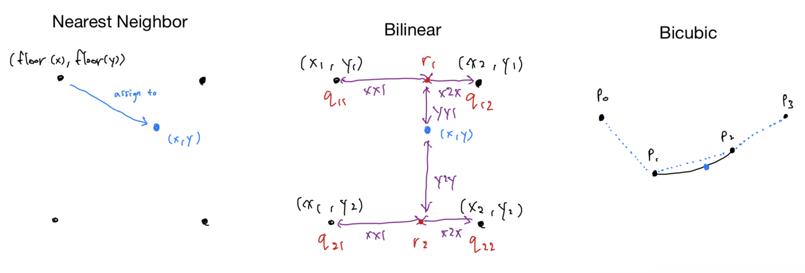
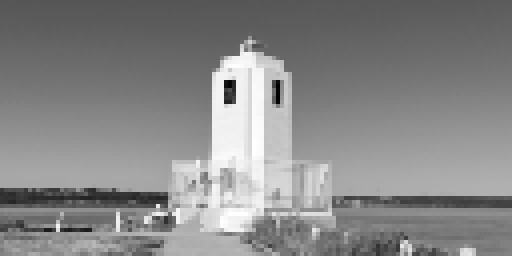
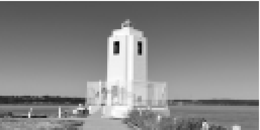
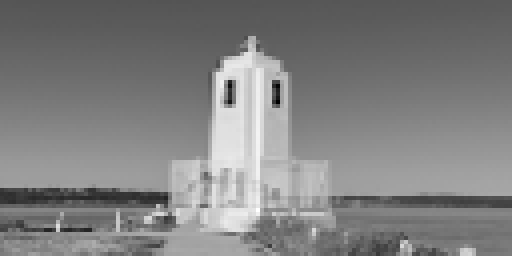

# 1. Image Pre-processing and Enhancement

## Computer Vision Algorithms

### Interpolate

The `Interpolate` class in the `VisualAlgo::ImagePreprocessingAndEnhancement` namespace provides different interpolation methods for scaling and enhancing image resolution. Interpolate is a method of estimating values between two points in an image or a series of data points. The `Interpolate` class provides three common types of interpolation: nearest neighbor, bilinear, and bicubic.



1. **Nearest Neighbor**: This is the simplest interpolation method where the value of an unknown pixel is assumed to be equal to the value of the nearest pixel in the input image.

2. **Bilinear**: This method takes the weighted average of the four nearest pixels to estimate the value of an unknown pixel. The weights are determined by the distance of the unknown pixel from these known pixels.

3. **Bicubic**: A slightly more sophisticated method. It estimates the value of an unknown pixel by taking the weighted average of the sixteen nearest pixels. The weights are determined by the distance of the unknown pixel from these known pixels and are calculated using a cubic function. 

    Bicubic interpolation uses cubic polynomials to estimate pixel intensities near the pixel of interest \(P(t)\). Particularly, this implementation uses the Catmull-Rom splines, which pass through two control points, \(P_1\) and \(P_2\). These points surround the point of interest, while \(P_0\) and \(P_3\) are used to determine the slope. The Catmull-Rom spline is designed so that the interpolated pixel value is a weighted sum of the four pixels surrounding it. Here's the 1D version with \(t\) representing the point of interest:

    $$P(t) = \sum_{i=0}^{3} P_i Q_i(t)$$

    where \(P_i\) are the control points, and \(Q_i(t)\) are the blending functions for the Catmull-Rom spline:

    $$Q_0(t) = -\frac{1}{2}t^3 + t^2 - \frac{1}{2}t \\
    Q_1(t) = \frac{3}{2}t^3 - 2.5t^2 + 1 \\
    Q_2(t) = -\frac{3}{2}t^3 + 2t^2 + \frac{1}{2}t \\
    Q_3(t) = \frac{1}{2}t^3 - \frac{1}{2}t^2 $$

    Substituting \(Q_i(t)\) into the original equation and simplifying yields:

    $$P(t) = 0.5 \times [ (2 P_1) + (-P_0 + P_2) t + (2P_0 - 5 P_1 + 4 P_2 - P_3) t^2 + (-P_0 + 3 P_1 - 3 P_2 + P_3) t^3 ]$$

    This equation corresponds to the `cubicInterpolation` function in the provided code.

#### Class Members and Methods

- `enum class InterpolationType`: Enumeration that provides a way to select the type of interpolation method. This can be `NEAREST`, `BILINEAR`, or `BICUBIC`.

- `to_string(InterpolationType type)`: A function that takes an `InterpolationType` and returns its string representation.

- `nearest(const Matrix &image, float x, float y)`: A static method that performs nearest neighbor interpolation on the given image at the specified coordinates `(x, y)`.

- `bilinear(const Matrix &image, float x, float y)`: A static method that performs bilinear interpolation on the given image at the specified coordinates `(x, y)`.

- `bicubic(const Matrix &image, float x, float y)`: A static method that performs bicubic interpolation on the given image at the specified coordinates `(x, y)`.

- `interpolate(const Matrix &image, float x, float y, InterpolationType type)`: A static method that interpolates the given image at the specified coordinates `(x, y)` using the specified interpolation type.

- `interpolate(const Matrix &image, float scale, InterpolationType type)`: A static method that scales the given image by the specified scale factor using the specified interpolation type.

- `interpolate(const Matrix &image, int rows, int cols, InterpolationType type)`: A static method that resizes the given image to the specified number of rows and columns using the specified interpolation type.

#### Example Usage

In this example, the `Interpolate` class is used to scale an image using bicubic interpolation.

```cpp
#include "helpers/Matrix.hpp"
#include "ImagePreprocessingAndEnhancement/Interpolate.hpp"

VisualAlgo::Matrix image;
image.load("datasets/ImagePreprocessingAndEnhancement/cat_resized.ppm");

VisualAlgo::Matrix image_scaled = 
    VisualAlgo::ImagePreprocessingAndEnhancement::Interpolate::interpolate(image, 2.0f, 
    VisualAlgo::ImagePreprocessingAndEnhancement::InterpolationType::BICUBIC);

image_scaled.save("datasets/ImagePreprocessingAndEnhancement/cat_scaled.ppm", true);
```

#### Visual Examples

Below are visual examples of the original image and the image after bicubic interpolation.

Original Image:


Scaled Image (scale = 0.5, method = NEAREST):



Scaled Image (scale = 0.5, method = BILINEAR):



Scaled Image (scale = 0.5, method = BICUBIC):



#### Note on Image Types:

These interpolation methods are designed to work with grayscale images. Color images are typically represented as multi-channel images (e.g., Red-Green-Blue), and these methods do not directly apply.

#### Note on Simplifications and Differences from Other Libraries:

While these interpolation methods implement the fundamental logic of nearest neighbor, bilinear, and bicubic interpolation, there are several simplifications in the implementation. These include:

1. **Edge Handling**: In the case where an interpolation point falls near the edge or outside the given image, our implementation clamps the coordinates to the image boundary. This approach is straightforward but not always ideal. Other libraries may offer more advanced edge-handling strategies, such as padding, mirroring, or extrapolation.

2. **Optimization**: The bicubic interpolation method, in particular, can be further optimized. Our implementation performs the calculations in a straightforward manner, which could be computationally heavy for large images. Other libraries may use optimized routines or hardware acceleration to speed up these operations.

---

### Transform

---

### Histogram Equalization

---

## Neuroscience Models

---
