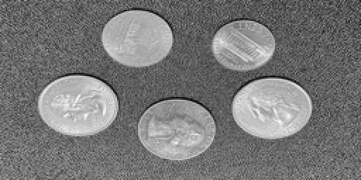
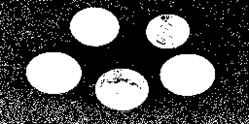
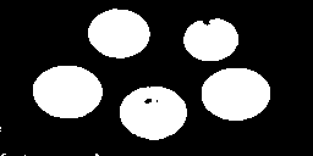
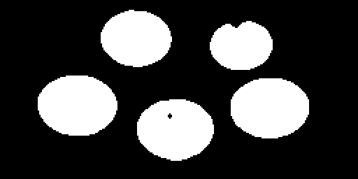
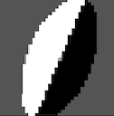
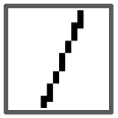

# 3. Segmentation and Grouping

## Computer Vision Algorithms

### Thresholding

The `Thresholding` class in the `VisualAlgo::SegmentationAndGrouping` namespace is the image thresholding algorithm. Image thresholding is a simple method of segmenting an image into different regions. It separates an image into foreground and background, by turning all pixels below some threshold to zero and all pixels above that threshold to one (or 255 in an 8-bit grayscale image).

#### Class Members and Methods

- `apply(const Matrix &img, float threshold)`: A static method that applies binary thresholding to the input image based on the given threshold value. All pixel intensity values below the threshold are set to 0 (representing the background), and all pixel intensity values equal to or above the threshold are set to 1 (representing the foreground).

#### Example Usage

In this example, the `Thresholding` class is used to apply binary thresholding to a coins image.

```cpp
#include "helpers/Matrix.hpp"
#include "SegmentationAndGrouping/Thresholding.hpp"

VisualAlgo::Matrix image;
image.load("datasets/SegmentationAndGrouping/coins.png");

VisualAlgo::Matrix threshold_image = VisualAlgo::SegmentationAndGrouping::Thresholding::apply(image, 0.5f);

threshold_image.save("datasets/SegmentationAndGrouping/coins_thresholding.png", true);
```

#### Visual Examples

Here are some pictures to show the steps of the process.

Original Image:



Image After Thresholding:



In the image above, after we used thresholding, you can see it looks grainy. This is because of the small bits of noise in the original picture. To clean this up without blurring the edges of the coins too much, we can use a median filter first, then apply thresholding.

Image After Median Filter and Thresholding:



After applying thresholding to the coin image, we might see small bits of noise again. We can clean this up by applying another median filter.

Image After Median Filter, Thresholding, and Another Median Filter:



---

### Region Growing

---

### Watershed

---

### K-means Clustering

---

### Mean Shift

---

### GrabCut

---

### U-Net

---

### Classical Region Proposal Methods

---

## Neuroscience Models

### The FBF Model

**Reference**: Grossberg and Wyse, "Figure-Ground Separation of Connected Scenic Figures: Boundaries, Filling-In, and Opponent Processing", *Neural Networks For Vision and Image Processing*, Chapter 7, 1992. [(Link to paper with the same topic but low scan quality)](https://sites.bu.edu/steveg/files/2016/06/GroWyse1991NN.pdf)

**Overview**: 

The FBF network model was used as part of the larger pattern recognition model by Grossberg et al.. It handles the initial steps of processing, up until the figure-ground separation phase. 

The FBF model is composed of two sub-systems: the Feature Contour System (FCS) and the Boundary Contour System (BCS), both initially proposed by Grossberg and Mingolla in 1985. As the processing sequence typically follows the pattern FCS-BCS-FCS, these combined systems are collectively referred to as the FBF networks.

The central idea posited by Grossberg is that these two systems collaboratively enable us to recognize surfaces (handled by the FCS) and boundaries (handled by the BCS). The FCS's role is to fill in the entire boundary region with consistent surface characteristics, relying on the boundaries computed by the BCS, which connects collinear contours to establish these boundaries. A notable point raised by Grossberg is our ability to recognize boundaries even when they're not directly visible, leading to illusions such as the Kanizsa triangle.

Please note that the FCS and BCS are hypothetical models for the visual system, distinguished by their function ("what" they are supposed to do) rather than their mechanism ("how" they are supposed to operate). These models have evolved significantly over time, and their definition is not bound by any specific method or implementation. The exact details often depend on specific research papers. Also, note that I've made a number of simplifications to the original model. For example, the original paper applied mathematics based on sub-pixel resolution (interpolating pixels), whereas the simple cells I used are entirely pixel-based.

**Algorithm Breakdown**: 

The FBF model algorithm consists of four steps:

* **Step 1: Discount the Illuminant**: Instead of uniformly applying the ON-Center-OFF-Surround (ON-C) and OFF-Center-ON-Surround (OFF-C) kernels (also known as Difference of Gaussian), the kernel is scaled with the image value to handle areas with varying brightness levels. Grossberg describes these cells as "shunting" because their dynamics are dependent on their current state, akin to an electrical system with a (shunting) resistor. This is believed to be part of the FCS's work, as it needs to perceive surfaces as continuous over a broad range of illumination levels. The output of the ON-C and OFF-C processes are denoted as \(\mathbf{x}\) and \(\bar{\mathbf{x}}\) respectively:

    $$ \mathbf{x} = \frac{\mathbf{I} \otimes (B \mathbf{C} - D \mathbf{E})}{A + \mathbf{I} \otimes (\mathbf{C} + \mathbf{E})}\\
    \bar{\mathbf{x}} = \frac{A \cdot S + \mathbf{I} \otimes (D \mathbf{E} - B \mathbf{C})}{A + \mathbf{I} \otimes (\mathbf{C} + \mathbf{E})}$$

    Here, the symbol \(\otimes\) represents the operation of 2D cross-correlation. \(\mathbf{I}\) represents the input image array, while \(A\), \(B\), and \(D\) are constants that define the shape of the ON-C and OFF-C kernels. The term \(S\) introduces the offset of the OFF-C kernel, ensuring that \(\bar{\mathbf{x}}\) primarily falls within the positive range. The values for those parameters can also be found in the paper.

    \(\mathbf{C}\) and \(\mathbf{E}\) denote two Gaussian kernels, as the ON-C and OFF-C kernels are "Differences of Gaussians" (DoG). The ON-C shape is derived from subtracting the wider and shorter Gaussian kernel \(\mathbf{E}\) from the narrower and taller Gaussian kernel \(\mathbf{C}\). For the OFF-C kernel, the procedure is reversed. The formulas for these kernels are:

    $$
    \mathbf{C} = C e^{-\frac{(p - i)^2 + (q - j)^2}{\alpha^2}}\\
    \mathbf{E} = E e^{-\frac{(p - i)^2 + (q - j)^2}{\beta^2}}\\
    $$

    where \(\alpha\) and \(\beta\) are two other constants. (Interestingly, Grossberg and Wyse applied a logarithmic transformation to the arguments of the exponent in their paper, a step that I did not use in my implementation. Instead, I use the "standard" form of Gaussian shown above.)

* **Step 2: CORT-X 2 Filter**: The CORT-X 2 Filter is a neurophysiologically inspired model that draws on Hubel and Wiesel's work on Simple, Complex, and Hypercomplex cells. It forms the BCS part of this model. The filter takes the output from the previous step as its input, and generates the boundaries. It operates in a purely feedforward manner and can be broken down into six sub-steps:

    * **Step 2a: Simple Cells**: These cells receive either \(\mathbf{x}\) or \(\bar{\mathbf{x}}\) as inputs. The are two scales kernels \(s\) for the kernels: \(s=1\), with major and minor axes of 12 and 6 pixels, and \(s=2\), with major and minor axes of 20 and 10 pixels. The kernel, \(\mathbf{K}\), comprises two ellipse halves, \(\mathbf{L_s}\) and \(\mathbf{R_s}\):

        $$\mathbf{K}_{s, L} (k) = \mathbf{L_s} (k) - \alpha_s \mathbf{R_s} (k) - \beta_s $$
        $$\mathbf{K}_{s, R} (k) = \mathbf{R_s} (k) - \alpha_s \mathbf{L_s} (k) - \beta_s$$

        

        Here, \(k\) denotes the orientation index of the kernel, ranging from k_0 = 0, k_1 = 22.5, ... to k_7 = 157.5 degrees. For clarity, note that Grossberg and Wyse didn't just rotate the simple cell kernel by 360 degrees. Instead, they rotate two kernels, \(\mathbf{L_s}\) and \(\mathbf{R_s}\), with opposite polarities by 180 degrees. This is because the kernels of the same orientation and opposite polarity will combine in the next step, making this notation more intuitive. The output of the simple cells comes from the cross-correlation between the ON-C (or OFF-C) signals, followed by half-wave rectification:

        $$\mathbf{S^+_{s, L}} (k) = \max(\mathbf{K}_{s, L} (k) \otimes \mathbf{x}, 0)$$
        $$\mathbf{S^+_{s, R}} (k) = \max(\mathbf{K}_{s, R} (k) \otimes \mathbf{x}, 0)$$
        $$\mathbf{S^-_{s, L}} (k) = \max(\mathbf{K}_{s, L} (k) \otimes \bar{\mathbf{x}}, 0)$$
        $$\mathbf{S^-_{s, R}} (k) = \max(\mathbf{K}_{s, R} (k) \otimes \bar{\mathbf{x}}, 0)$$

    * **Step 2b: Complex Cells**: The complex cells combine the responses from simple cells of the same orientation. Be aware that the \(\mathbf{C}\) notation here represents the response map of complex cells, not the Gaussian from Step 1.

        $$\mathbf{C}_s (k) = F \left[ \mathbf{S^+_{s, L}} (k) + \mathbf{S^+_{s, R}} (k) + \mathbf{S^-_{s, L}} (k) + \mathbf{S^-_{s, R}} (k) \right]$$

        Here, \(F\) is another constant parameter. Half-wave rectification isn't necessary as the output is always non-negative.

    * **Step 2c: Hypercomplex Cells (First Competitive Stage)**: This step resembles the non-max suppression in Canny edge detection as it aims to inhibit texture around boundaries that lack other collinear edges. This is accomplished by dividing the complex cells response map by the cross-correlation between the complex cell response and the oriented competition kernel \(\mathbf{G_s} (k)\). This kernel is normalized and positive everywhere except along the direction of the complex cell's corresponding orientation. Consequently, if there are non-collinear edges in the vicinity, the cross-correlation term in the denominator becomes large.

        

        $$\mathbf{D}_{s} (k) = \max \left[\frac{\mathbf{C_s}(k)}{\epsilon + \mu \sum_m (\mathbf{C_s} (m) \otimes \mathbf{G_s} (k))} - \tau, 0\right]$$

    * **Step 2d: Hypercomplex Cells (Second Competitive Stage)**: In this stage, only the dominant orientation is preserved (winner-takes-all) for each location on the complex cell map, \(\mathbf{C_s} (k)\).

    $$\mathbf{D}_s := \max_k \mathbf{D}_s (k)$$

    * **Step 2e: Multiple Scale Interaction: Boundary Localization and Noise Suppression**: 


### CONFIGR (Carpenter, Gaddam, and Mingolla, 2007)
* [Paper](https://pubmed.ncbi.nlm.nih.gov/18024082/)


### Tolerance Space Theory (TST) for Gestalt Proximity Principle (Peng, Yang, and Li, 2021)
* [Paper](https://jov.arvojournals.org/article.aspx?articleid=2772625)


### Gestalt Laws Models
### Border Ownership Models
