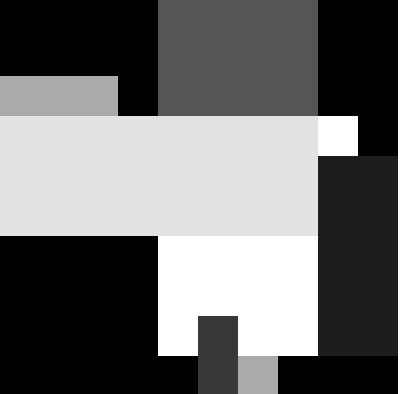
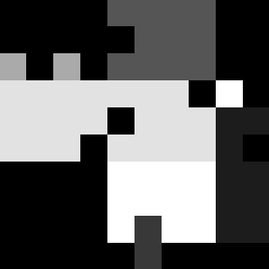

# VisualAlgo::Stimulus Namespace Documentation

The `VisualAlgo::Stimulus` namespace provides functions to create stimuli in the form of 2D matrices and add noise to them.

---

## Include

```cpp
#include "helpers/stimulus.hpp"
#include "helpers/matrix.hpp"
```

---

## Functions

* `Matrix random_mondrian(int rows, int cols, int num_rectangles);`

The type of stimuli were used in Edwin Land's research on illuminant discounting and filling-in (1977 and 1983). Land named it McCann Mondrians, a tribute to his research partner, John McCann, and the Dutch artist Piet Mondrian (Grossberg, 2021).

Creates a new `Matrix` object with the given number of `rows` and `cols`, and draws a specified number of random overlapping rectangles in it.

Each rectangle has a random position and size, and a random value in the range [0, 1]. The size of the rectangle scales with `rows` and `cols`.

Returns the new `Matrix`.

```cpp
VisualAlgo::Stimulus::Matrix matrix = random_mondrian(10, 10, 10);
```


* `void add_noise(Matrix &matrix, float noise_probability);`

Randomly changes some percentage of pixels in the given `matrix` to any value in the range [0, 1].

`noise_probability` is the fraction of pixels that will be changed. It must be a value between 0 and 1.

```cpp
VisualAlgo::Stimulus::Matrix matrix = random_mondrian(10, 10, 10);
add_noise(matrix, 0.1);
```

This creates a 10x10 matrix with 10 randomly placed squares, and then adds noise to 10% of the pixels.


